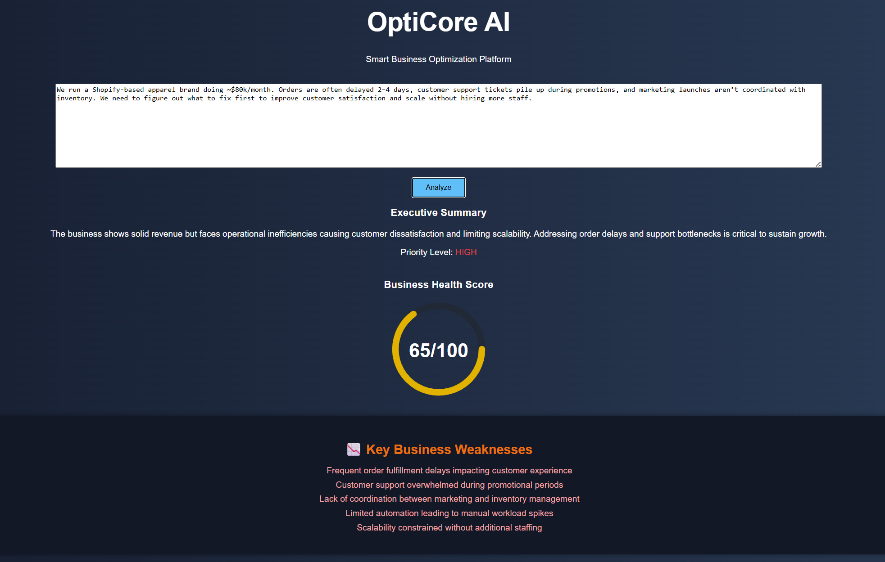
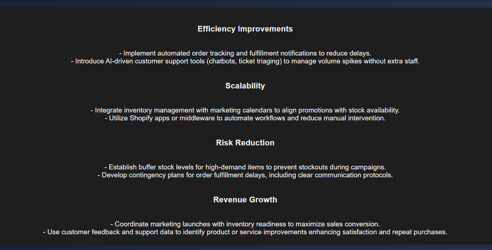

# OptiCore AI

OptiCore AI is a full-stack web application that helps businesses turn unstructured input into clear optimization reports.

I built this project to explore how AI can turn vague business problems into structured insights using a clean full-stack architecture.

---

## Demo Preview

**Input:** A real-world business problem describing operational bottlenecks  
**Output:** An executive summary, priority level, health score, and structured recommendations

### Initial Analysis View

### Generated Insights & Recommendations

---

## Key Features

- Accepts free-form business descriptions
- Uses AI to identify priorities and problem areas
- Generates structured summaries and recommendations
- Presents insights through a clean, responsive web interface

---

## Project Structure

backend/
app.py # Flask application entry point
ai_engine.py # AI logic for analyzing business input
config.py # Configuration and environment setup
templates/ # HTML templates
static/ # CSS and frontend assets
requirements.txt

---

## Tech Stack

- **Backend:** Python, Flask  
- **AI:** OpenAI API  
- **Frontend:** HTML, CSS, JavaScript  

---

## Status

Actively improving and iterating
